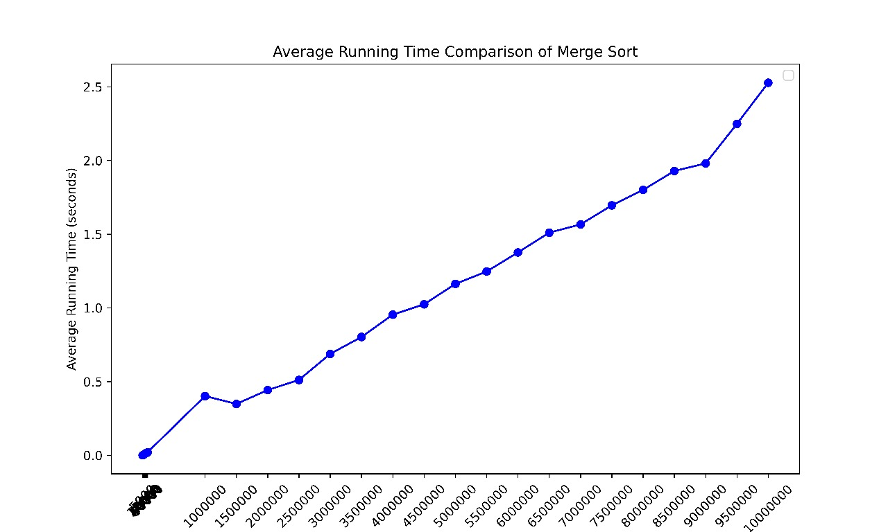
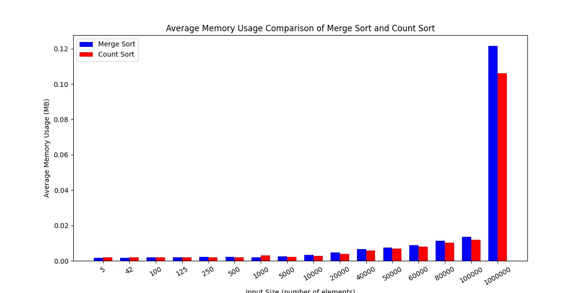

# Part 1: Distributed Sorting System Performance

## Implementation Analysis

In implementing a distributed sorting system, we adopted two primary algorithms: **Distributed Count Sort** and **Distributed Merge Sort**. 

**Distributed Merge Sort**:  
We chose to create a thread for each merge operation to parallelize the sorting across multiple systems. This approach allowed each thread to handle a portion of the sorting workload, thus increasing the overall sorting speed.

**Pros**:
- Efficient for large datasets due to its divide-and-conquer approach.
- Scales well across multiple processors or nodes, making it suitable for distributed environments.

**Cons**:
- Higher memory usage, especially with large data sets, due to the intermediate results created during merging.
- Thread overhead may increase for small tasks, as creating and managing threads can introduce resource consumption.

**Distributed Count Sort**:  
Count Sort was selected for datasets with a limited value range, allowing for faster sorting without comparisons. This approach is particularly effective for data that falls within a predefined, limited range.

**Pros**:
- Fast and memory-efficient for smaller data sets with a constrained range of values.
- Performs well when value distribution is predictable and bounded, as Count Sort avoids comparison-based sorting.

**Cons**:
- Scalability is limited when handling data with wide or unbounded value ranges, as its efficiency depends on the range of values.
- Not ideal for data with high variability or non-integer values.

## Execution Time Analysis

Execution time was recorded for each sorting method with datasets of varying sizes (small, medium, and large). For Count Sort, we used datasets with a limited range to match the algorithm’s intended use case.

| File Size (Values) | Count Sort Execution Time (seconds) | Merge Sort Execution Time (seconds) |
|--------------------|-------------------------------------|-------------------------------------|
| 50 (small)         | 0.000808                           | 0.000399                           |
| 10,000 (medium)    | 0.001708                           | 0.003477                           |
| 10,000,000 (large) | 0.541529                           | 2.239869                           |

**Observations**:
- **Small datasets**: Both algorithms performed similarly, with Merge Sort having a slight advantage.
- **Medium datasets**: Count Sort maintained a small performance lead over Merge Sort due to its range-constrained efficiency.
- **Large datasets**: Count Sort showed strong performance within a limited value range, but Merge Sort would generally scale better with datasets containing a wider range of values, as its performance is range-independent.

## Memory Usage Overview

Memory usage was tracked for both algorithms across small and large datasets to assess efficiency.

| File Size (Values) | Merge Sort Memory Usage (bytes) | Count Sort Memory Usage (bytes) |
|--------------------|---------------------------------|---------------------------------|
| 5 (small)          | 1880                            | 1954                            |
| 100 (small)        | 1909                            | 2007                            |
| 100,000 (medium)   | 14,178                          | 12,581                          |
| 1,000,000 (large)  | 127,526                         | 111,176                         |

**Observations**:
- For smaller datasets, memory usage was similar, with Count Sort consuming marginally more memory.
- For larger datasets, Count Sort was more memory-efficient with limited-range data, while Merge Sort required additional memory for recursive operations and merging.

## Graphs

- 
- 
- 

## Summary

**Distributed Count Sort** proved highly efficient and scalable within its limited range, consistently showing faster execution times. However, **Distributed Merge Sort** is more versatile for a wider variety of data sizes and distributions, particularly with datasets containing a broad range of values, where Count Sort’s efficiency would drop.

### Potential Optimizations

To further improve performance on large datasets, potential optimizations include memory management for Merge Sort to reduce the impact of recursive calls, and thread handling adjustments to balance workload efficiency. For Count Sort, tuning for adaptable range handling could increase its versatility in broader applications.